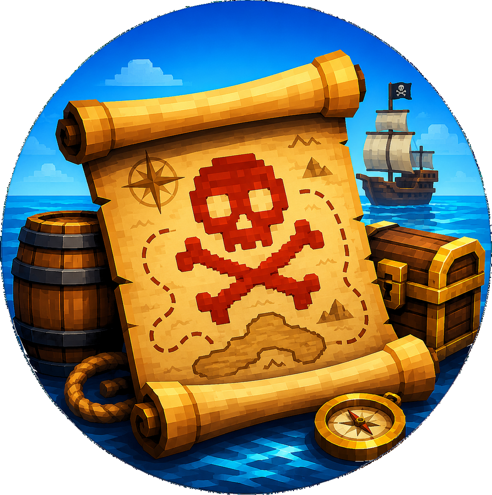
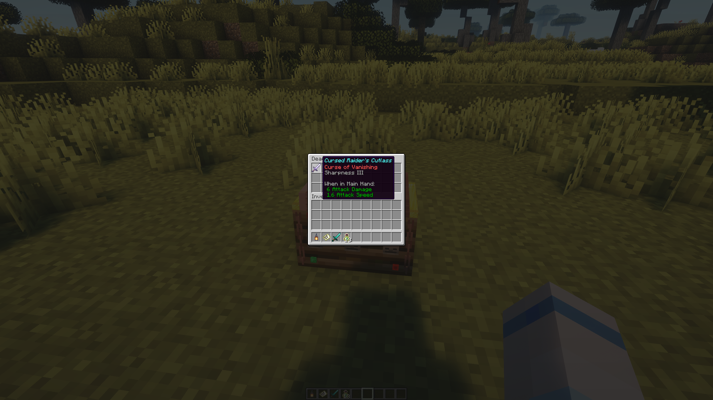

<p align="center">
  
</p>

<h1 align="center">Deadman's Chest</h1>

<p align="center">
  <strong>Drifting barrels, soggy pirate maps, cursed guardians, and buried treasure for PaperMC servers.</strong>
</p>

<p align="center">
  <em>No resource pack. No NMS. Just pirate treasure hunts built with supported Paper/Bukkit APIs.</em>
</p>

---

## What Is Deadman's Chest?

**Deadman's Chest** turns the open ocean into the beginning of a survival-friendly pirate adventure.

While exploring the world, players may discover strange glowing barrels drifting in the water. Claim the soggy map inside, follow the skull-marked chart, locate the cursed treasure marker, defeat the guardians, and claim whatever the dead left behind.

But treasure is never truly free.

A dead pirate does not give up his loot willingly.

---

## The Gameplay Loop

Deadman's Chest is built around a complete treasure-hunt loop:

```text
Find a drifting barrel
  -> Claim the soggy treasure map
  -> Watch the wet parchment reveal itself
  -> Follow the skull-marked chart
  -> Discover the cursed treasure marker
  -> Activate the marker
  -> Defeat the skeleton guardians
  -> Watch as the chest is revealed
  -> Loot the treasure
  -> See the chest cleansed and vanish
```

The goal is not to create a complicated quest system. The goal is to add mystery, danger, and reward to normal survival exploration.

---

## Features

* Floating treasure barrels that spawn in the world using custom models
* Three treasure tiers: **Emerald**, **Ruby**, and **Diamond**
* Custom soggy parchment-style treasure maps
* Animated wet-map reveal effect
* Skull-and-crossbones treasure marker drawn directly onto the map
* Standard Minecraft player tracking cursor on the custom map
* Cursed treasure markers placed in the world
* Skeleton guardian encounters based on treasure tier
* Custom treasure chest model
* Chest reveal animation after guardians are defeated
* Chest loot inventory instead of forced item delivery
* Chest remains while loot is still present
* Chest vanishes with a cleansing effect once emptied
* Configurable loot tables
* Support for enchanted book rewards
* Support for custom configured loot
* Operator cleanup command for Deadman's Chest entities
* No resource pack required
* No NMS or internal server classes

Deadman's Chest is designed to feel like something that belongs naturally in a survival world: rare, atmospheric, dangerous, and rewarding.

---

## Treasure Tiers

Deadman's Chest uses three visual treasure tiers.

Each tier carries through the entire hunt:

```text
barrel band
  -> map skull color
    -> treasure marker gem
      -> treasure chest gem
```

| Tier        | Theme        | Description                                                                                |
| ----------- | ------------ | ------------------------------------------------------------------------------------------ |
| **Emerald** | Green        | The most common treasure tier. A good early-to-mid survival reward.                        |
| **Ruby**    | Redstone red | A stronger treasure tier with better rewards and tougher guardians.                        |
| **Diamond** | Diamond blue | The highest treasure tier, guarded by the strongest encounter and capable of rare rewards. |

The tier is visible before the fight begins, giving players a chance to decide how prepared they want to be.

Bring a sword.

Bring a shield.

Bring friends.

Bring wolves.

Maybe bring iron blocks and pumpkins if you like solving problems the Minecraft way.

---

## Screenshots and Videos

### Finding a Barrel


### Receiving a Soggy Map


### Following the Treasure Map


### Discovering the Treasure Marker


### Fighting the Guardians


### Guardians Defeated


### Chest Reveal


### Loot and Cleansing

 


Video clips are especially useful for this plugin because much of the appeal is in the animation and atmosphere:

<p align="center">
  <video src="https://github.com/user-attachments/assets/c6ab1023-3e56-4a93-958c-96edd017caf0" controls width="800"></video>
  <em>Watching the soggy map reveal</em>
</p>  
<p align="center">
<video src="https://github.com/user-attachments/assets/d4b9aff1-432a-4ac9-bef8-e37c1129fd21" controls width="800"></video>
  <em>Reaching the marker and triggering the guardians</em>
</p>
<p align="center">
<video src="https://github.com/user-attachments/assets/f010ead1-b62f-4efd-9a9f-c3da5f91acfa" controls width="800"></video>
  <em>The chest is revealed</em>
</p>
<p align="center">
<video src="https://github.com/user-attachments/assets/082967b9-5e6f-4c7d-8f9c-fd16113f4c05" controls width="800"></video>
  <em>Getting the loot and cleansing the location</em>
</p>

---

## Why This Exists

Minecraft survival already has wonderful systems:

* oceans
* maps
* exploration
* hostile mobs
* wolves
* iron golems
* enchanted gear
* rare resources
* strange places in the world

Deadman's Chest tries to connect those systems into a small adventure.

It gives players a reason to sail, explore, prepare, fight, and return home with a story.

It also provides an alternate path to meaningful rewards such as enchanted books and useful supplies, especially for servers that do not want villager trading halls to dominate progression.

---

## Installation

1. Download the latest release.
2. Drop the plugin jar into your server's `plugins/` directory.
3. Start or restart the server.
4. Review the generated configuration file.
5. Watch the waters.

When the plugin is running, treasure barrels may begin appearing in valid water locations depending on your configuration.

---

## Requirements

* **PaperMC**
* **Java 21+**
* Minecraft/Paper version targeted by the current release

### Tested Against

* Paper 1.21.x
* Paper 26.1.2
* Paper 26.2

Built with Java 21


Deadman's Chest uses supported Bukkit/Paper APIs and does not rely on NMS or internal server classes.

---

## Configuration

Deadman's Chest is intended to be configurable while still having sensible defaults.

Configuration areas include:

* Barrel spawn limits
* Barrel lifetime
* Treasure generation distance
* Treasure tier weighting
* Loot tables
* Enchanted book chances
* Custom loot additions
* Cleanup/debug behavior

Example configuration shape:

```yaml
debug: true

messages:
  treasure-recovered:
    enabled: true
    broadcast: false
    text: "%player% has recovered the treasure of %adjective% pirate %pirate_name% and broken the curse."

barrels:
  max-active: 30
  min-lifetime-minutes: 4
  max-lifetime-minutes: 12
  seconds-between-spawn-checks: 30
  min-distance-between-barrels: 128

loot:
  remove-defaults: false

  level-1:
    rolls: 4
    remove:
      - minecraft:cooked_cod
    add:
      - material: minecraft:copper_ingot
        min: 4
        max: 12
        weight: 12

  level-2:
    rolls: 6
    book-chance-percent: 18
    remove: []
    add:
      - material: minecraft:lapis_lazuli
        min: 4
        max: 16
        weight: 8
    add-books:
      - enchantment: minecraft:mending
        level: 1
        weight: 1
      - enchantment: minecraft:fortune
        level: 2
        weight: 2
      - enchantment: minecraft:efficiency
        level: 4
        weight: 2
    custom:
      - material: minecraft:iron_sword
        name: "Cursed Raider's Cutlass"
        min: 1
        max: 1
        weight: 2
        enchants:
          - enchantment: minecraft:sharpness
            level: 3
          - enchantment: minecraft:vanishing_curse
            level: 1
      - material: minecraft:iron_chestplate
        name: "Salt-Stained Breastplate"
        min: 1
        max: 1
        weight: 2
        enchants:
          - enchantment: minecraft:protection
            level: 3
          - enchantment: minecraft:binding_curse
            level: 1
        
  level-3:
    rolls: 8
    book-chance-percent: 35
    remove:
      - minecraft:enchanted_golden_apple
    add:
      - material: minecraft:diamond
        min: 2
        max: 5
        weight: 8
      - material: minecraft:trident
        min: 1
        max: 1
        weight: 1
    add-books:
      - enchantment: minecraft:mending
        level: 1
        weight: 2
      - enchantment: minecraft:fortune
        level: 3
        weight: 3
      - enchantment: minecraft:efficiency
        level: 5
        weight: 4
      - enchantment: minecraft:protection
        level: 4
        weight: 4
      - enchantment: minecraft:sharpness
        level: 5
        weight: 4
    custom:
      - material: minecraft:diamond_sword
        name: "Deadman's Blade"
        min: 1
        max: 1
        weight: 1
        enchants:
          - enchantment: minecraft:sharpness
            level: 5
          - enchantment: minecraft:fire_aspect
            level: 2
      - material: minecraft:diamond_pickaxe
        name: "Buried King's Pick"
        min: 1
        max: 1
        weight: 1
        enchants:
          - enchantment: minecraft:efficiency
            level: 5
          - enchantment: minecraft:fortune
            level: 3
```

Exact configuration options may change during beta as gameplay balance is tuned.

---

## Loot

Treasure chests use a chest-sized inventory window.

Loot is not forced directly into the player inventory. This avoids losing rewards when a player's inventory is full.

Current behavior:

```text
Player opens treasure chest
  -> Loot inventory appears
  -> Player takes items
  -> Chest remains if loot is still present
  -> Chest is removed only after the loot inventory is emptied
```

This makes the reward feel like an actual treasure chest rather than a simple item payout.

### Loot Categories

Deadman's Chest loot may include:

* Food
* Ingots and gems
* Experience bottles
* Saplings and useful survival items
* Armor
* Tools
* Weapons
* Rare items
* Enchanted books
* Custom configured treasure items

### Enchanted Books

Enchanted books can appear in higher-tier treasure.

The intent is to make treasure hunting a meaningful alternate reward path without making books too common.

Recommended balance:

| Tier    | Book Behavior               |
| ------- | --------------------------- |
| Emerald | No premium books by default |
| Ruby    | Chance for useful books     |
| Diamond | Chance for top-tier books   |

A chest should never be flooded with books. Books are meant to feel special.

### Custom Loot

Server owners may configure custom loot entries such as enchanted tools, armor, or weapons.

Example:

```yaml
loot:
  level-3:
    custom:
      - material: DIAMOND_SWORD
        name: "Deadman's Blade"
        min: 1
        max: 1
        weight: 1
        enchants:
          - enchantment: sharpness
            level: 5
          - enchantment: vanishing_curse
            level: 1
```

Custom loot is intended for server owners who want to add their own flavor while preserving the core treasure-hunt experience.

---

## Encounters

Treasure markers are not harmless decorations.

When activated, they summon skeleton guardians. The number and strength of guardians depends on treasure level.

| Tier    | Encounter Feel                               |
| ------- | -------------------------------------------- |
| Emerald | Small fight                                  |
| Ruby    | Moderate fight                               |
| Diamond | Stronger fight with a captain-style guardian |

Guardians are configured to avoid becoming gear farms. Their purpose is to protect the treasure, not to replace the reward chest.

The encounter is designed to be dangerous but not absurd. Players can prepare using normal survival tools:

* Better armor
* Shields
* Bows
* Potions
* Wolves
* Friends
* Iron golems
* Terrain preparation

Deadman's Chest creates the problem. Minecraft gives players many ways to solve it.

---

## World Atmosphere

Deadman's Chest leans into a cursed pirate mood:

* glowing barrels drifting at sea
* damp parchment maps
* skull-marked treasure locations
* soul fire
* skeleton guardians
* treasure chests rising from the earth
* lightning and fire cleansing the empty chest

The plugin works in normal survival worlds, but it especially shines in atmospheric coastal, island, pirate, or night-focused servers.

---

## Commands

Commands are primarily intended for operators and server recovery.

| Command                | Description                                       |
| ---------------------- | ------------------------------------------------- |
| `/deadmanschest:info`  | Shows current spawned barrel information.         |
| `/deadmanschest:flush` | Removes Deadman's Chest tagged world components. |

Command behavior may change as the plugin matures.

During beta, commands may be more permissive or debug-oriented than they will be in a final release.

---

## Operator Notes

Deadman's Chest uses Display Entities, Interaction entities, PersistentDataContainer tags, and custom map renderers.

Important behavior:

* Barrels are transient and non-persistent.
* Barrel counts are limited by configuration.
* Treasure maps are player-held custom maps.
* Treasure markers may persist in the world until activated.
* Treasure chests remain only while loot remains.
* Operator cleanup tools exist for removing Deadman's Chest world entities if needed.

This design allows abandoned treasure markers to become atmospheric world dressing while still giving server operators a recovery path.

---

## Performance Notes

Deadman's Chest is designed to keep active entity counts bounded.

* Floating barrels are capped and time out.
* Treasure markers are lightweight Display/Interaction compositions.
* Guardians exist only during active encounters.
* Treasure chests exist only while unclaimed or partially looted.
* Cleanup commands are available for operators.

The plugin avoids NMS and avoids resource-pack dependency.

As with any plugin using visual entities, server owners should avoid extreme configuration values that create excessive numbers of active world objects.

---

## Current Status

Deadman's Chest is currently in beta.

The full gameplay loop is playable:

```text
barrel -> map -> marker -> guardians -> chest -> loot -> cleanup
```

Current focus areas:

* Survival-world testing
* Loot balance
* Configuration polish
* Edge-case cleanup
* Documentation
* Release packaging

Feedback, bug reports, and suggestions are welcome.

---

## Design Philosophy

Deadman's Chest is not meant to be a full quest engine.

It is meant to add a small, memorable adventure to survival play.

The best moments should feel like stories players tell afterward:

* I saw something glowing out on the water.
* The map was soaked, but it started to reveal itself.
* We found the skull marker at night.
* The skeletons came out of nowhere.
* The chest rose out of the ground after the last guardian fell.
* We got a Mending book and barely made it home.

That is the experience this plugin is trying to create.

---

## Compatibility

Deadman's Chest should work well with ordinary Paper survival servers.

It is especially fun alongside plugins or server styles that encourage:

* sailing
* exploration
* coastal bases
* survival progression
* dangerous nights
* reduced villager-trading dependence
* world ambience

No client mod is required.

No resource pack is required.

---

## Inspiration

Deadman's Chest is inspired by:

* pirate legends
* cursed treasure
* shipwreck stories
* old parchment maps
* strange things floating in the ocean
* skeleton crews
* survival worlds that reward exploration

A pirate, even a dead one, is not going to give up his loot willingly.

---

## License

Deadman's Chest is licensed under the MIT License.

See the [LICENSE](LICENSE) file for full details.

---

## Final Thoughts

Deadman's Chest is meant to add mystery to the ocean and danger to treasure hunting.

Not every barrel should be ignored.

Not every map should be trusted.

Not every treasure should be easy to claim.
